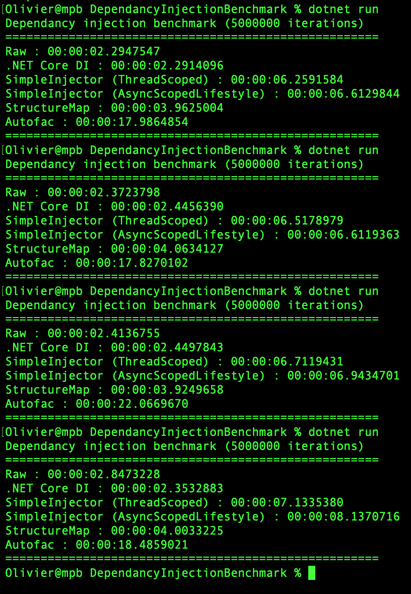

Dependancy Injection Library BenchMark
===========

This is a simple project to show the performance of the main DI mechanism (Microsoft.Extentions.DependancyInjection, StructureMap, SimpleInjector, Autofac and without DI).

I join the result i get with a MBP 2013 w/ Intel i5

